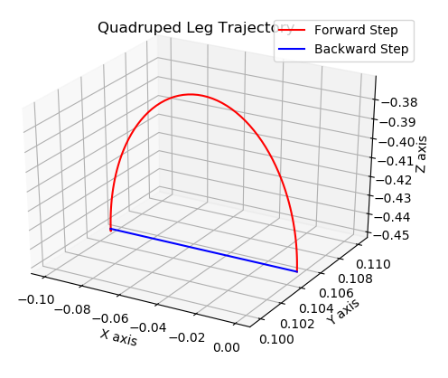

# JAMAL 2 Quadruped Robot

This repository contains the software framework for the JAMAL Quadruped project. 

## Foot Trajectory Generator (FTG)

The role of the FTG is to provide a series of points along a smooth trajectory which will allow the foot to swing forward. We have used an semi-elliptical trajectory along with trapezoidal time-profiling.



## Running the Gazebo Simulation

To start the gazebo simulation, run the following in the command line:
```bash
roslaunch jamal2_v5 gazebo.launch
```

After launching the simulation, the following test scripts can be run:

#### Basic Sit and Stand

```bash
rosrun jamal2_v5 test_sit_stand.py
```

#### Inverse Kinematics Implementation

Give a viable coordinate to the robot in the script. Then run:
```bash
rosrun jamal2_v5 test_ik.py
```

#### Foot Trajectory Generation (FTG) Testing

```bash
rosrun jamal2_v5 test_elliptical_traj.py
```